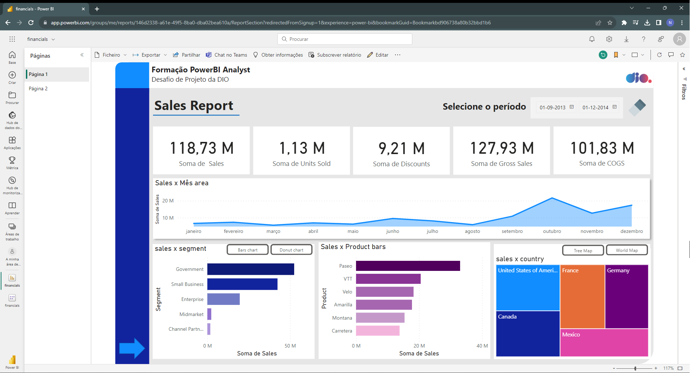
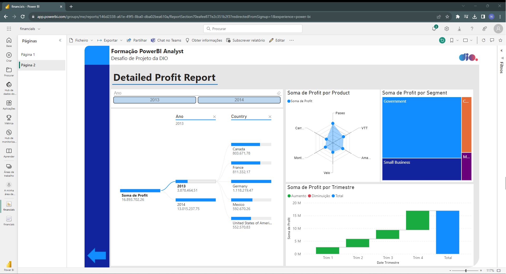

# Visualização e Análise de Dados com PowerBI

Este repositório é um fork da Juliana Mascarenhas, Tech Education Specialist na DIO. Foi adicionada uma pasta, [desafio_de_projeto](/desafio_de_projeto) com os arquivos da atividade "Criando um Relatório de Vendas Elegante com Power BI"

## Desafio de Projeto

Consistiu em desenvolver um relatório financeiro com duas páginas, a primeira apresenta os dados de vendas e a segunda, os dados dos lucros. O objetivo é gerar conteúdo relevante para extrair informações sobre a saúde do negócio.

Os dados brutos foram coletados a partir da planilha [Financial Sample.xlsx](https://github.com/nphara/power_bi_analyst/tree/main/dataset)

